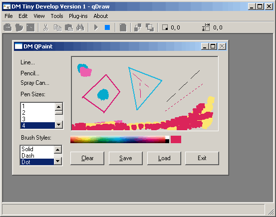



## DM Tiny Develop Environment Ver 1

### Description

This is an update of DM Tiny Develop Environment Ver 1 anyway Loads of bug fixes, New .Net type of toolbar more code editor options, new projects,Code Templatre helpers for. Editor and IDE config options, XP Theme support,Plug-in support, CodeinSight helpers, and more. Please vote if you like this code. Let me know what you all think.
 
### More Info
 

             |
---                |---
**Submitted On**   |2004-07-04 23:51:40
**By**             |[dreamvb](https://github.com/Planet-Source-Code/PSCIndex/blob/master/ByAuthor/dreamvb.md)
**Level**          |Advanced
**User Rating**    |5.0 (15 globes from 3 users)
**Compatibility**  |VB 6\.0
**Category**       |[Complete Applications](https://github.com/Planet-Source-Code/PSCIndex/blob/master/ByCategory/complete-applications__1-27.md)
**World**          |[Visual Basic](https://github.com/Planet-Source-Code/PSCIndex/blob/master/ByWorld/visual-basic.md)
**Archive File**   |[DM\_Tiny\_De18085910212004\.zip](https://github.com/Planet-Source-Code/dreamvb-dm-tiny-develop-environment-ver-1__1-56858/archive/master.zip)

